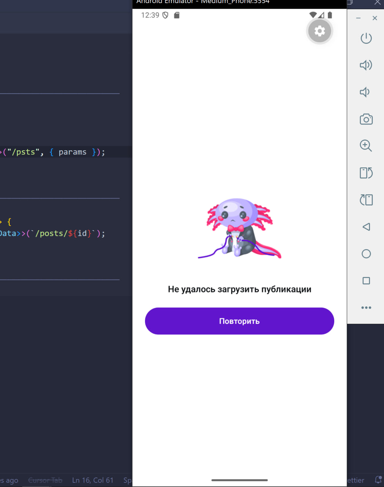
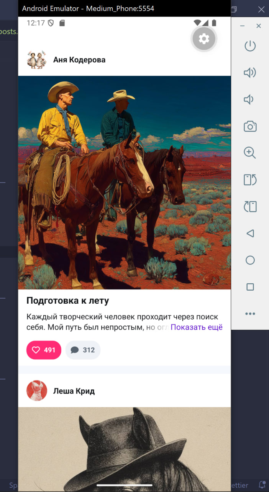
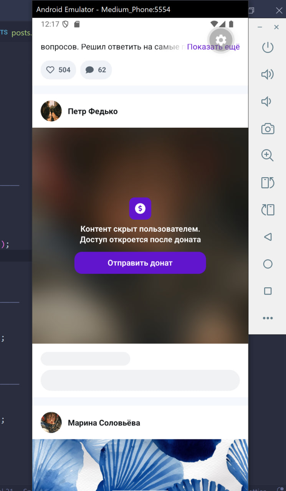
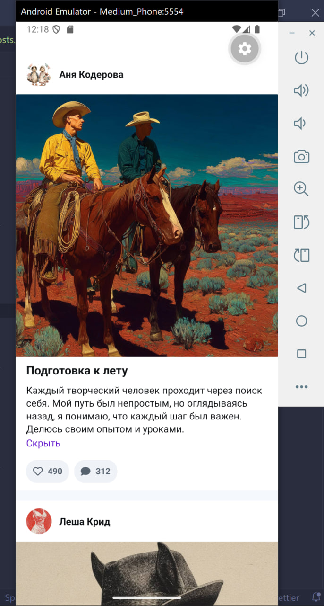

# React Native News Feed App

Тестовое задание — мобильное приложение на React Native с лентой постов.

## Скриншоты

|            Обработка ошибок             |              Лента постов              |               Платный пост               |             Лайки и текст              |
| :-------------------------------------: | :------------------------------------: | :--------------------------------------: | :------------------------------------: |
|  |  |  |  |

## Реализовано

- **Лента постов** — бесконечная прокрутка, новые посты подгружаются при скролле вниз
- **Обработка ошибок** — при сетевой ошибке отображается экран с иллюстрацией и кнопкой повтора
- **Платный контент** — посты с ограниченным доступом размываются с оверлеем и кнопкой доната
- **Разворачиваемый текст** — длинные превью обрезаются до 2 строк с градиентом и кнопкой «Показать ещё»
- **Лайки** — optimistic update через React Query, можно поставить и убрать лайк
- **MobX** — управляет UI-стейтом разблокированных платных постов (`unlockedPostsStore`)

## Стек

- **React Native** + **Expo SDK 54**
- **expo-router** — навигация
- **Axios** — HTTP-клиент
- **TanStack React Query** — кеширование, бесконечная пагинация, optimistic updates
- **MobX** — UI state management для платного контента

## Запуск

```bash
pnpm install
```

Создай `.env` на основе `.env.example`:

```bash
cp .env.example .env
```

```bash
# Android
npx expo start --android

# iOS
npx expo start --ios
```
